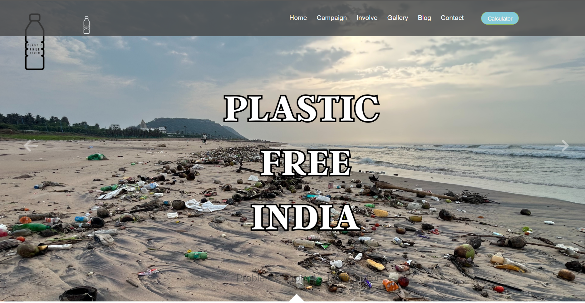
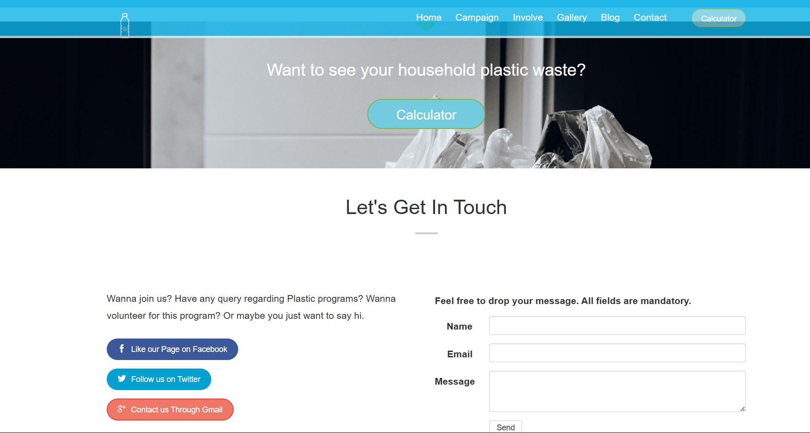

# 🧩 Plastic Free India
A real-time awareness and engagement platform for the “Plastic Free India” campaign run by India Youth for Society (IYFS).

🌐 Live Website: [plasticfreeindia.org](https://plasticfreeindia.org)

<p align="center">
  
  
</p>

# 🌍 Project Overview
- Plastic Free India is an initiative by India Youth for Society (est. 2011) that aims to raise environmental awareness and mobilize communities to reduce single-use plastic usage. The campaign educates users on laws, recycling, alternatives, and sustainable practices
Your website translates this mission into a dynamic and interactive experience, featuring:
- Live campaign info: Mission, journey, policy awareness, alternatives
- Interactive sections: Campaign details, involvement steps, image gallery, blog articles, FAQ, and contact form
- Plastic Footprint Calculator: Estimate your personal plastic usage
- Responsive Frontend: Built purely using HTML, CSS, and JavaScript

# 🚀 Features
- Real-time content delivery: Live blog posts and image gallery updates
- Calculator tool: Helps users assess their plastic footprint
- Engagement forms: Lets users inquire, volunteer, and share suggestions
- Mobile-friendly design: Fully responsive layout on all devices
- Clear navigation: Separate pages for each section (Home, Campaign, Involve, etc.)

lang="md" ## 📂 Repository Structure ``` / ├── index.html ← Home page with highlights ├── campaign.html ← Details of the Plastic Free India campaign ├── involve.html ← How to participate (volunteer, donations, events) ├── gallery.html ← Image gallery ├── blog.html ← Blog listing & posts ├── faq.html ← Frequently Asked Questions ├── calculator.html ← Plastic Footprint Calculator tool ├── contact.html ← Contact & volunteer form ├── assets/ ← CSS, JS, and images │ ├── css/ │ └── js/ └── README.md ← This file ``` 

# 💻 Technologies Used
Technology             	Purpose
 HTML	                  Structure and content
 CSS	                  Styling and responsive design
 JavaScript	            Interactivity & calculator logic
(No backend frameworks used yet)	

# 📫 Contact
For feedback or volunteering, drop a message via [LinkedIn](https://www.linkedin.com/in/nandan-pakki-v-k-01639b253)

# 📝 Acknowledgments
- India Youth for Society (IYFS) for the campaign concept and content
- Inspiration for content structure: FAQ section


